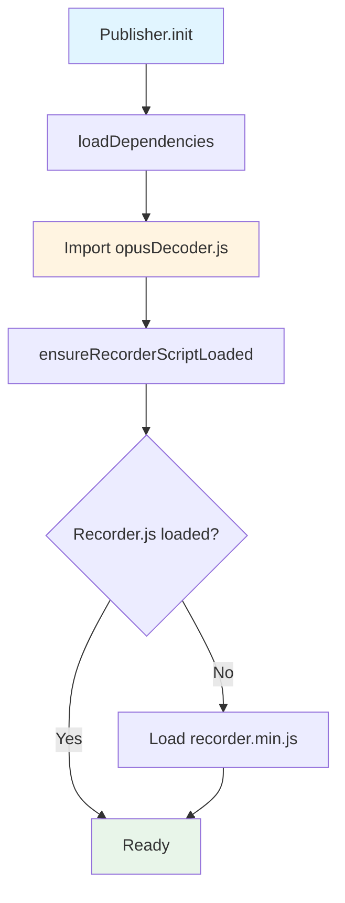
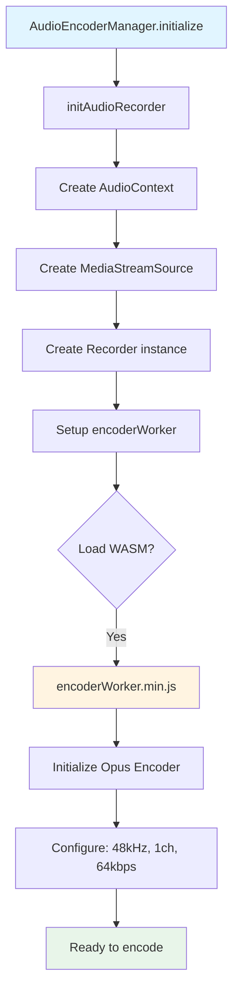
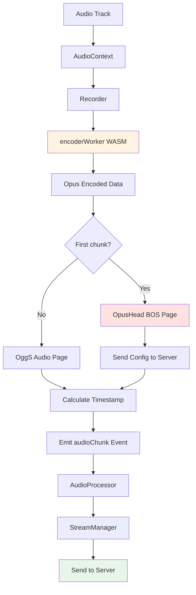
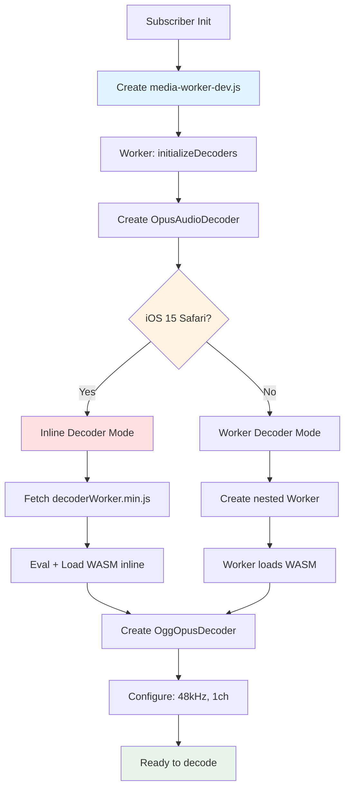
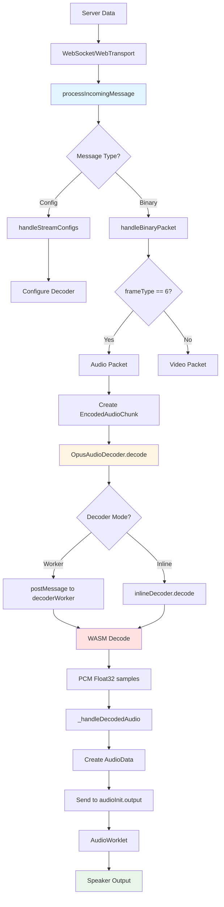
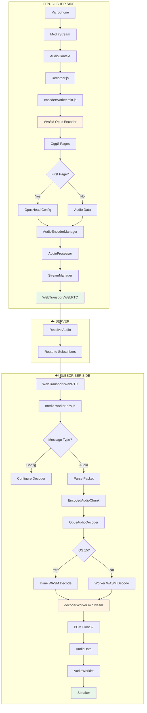

# Luồng Publish/Subscribe Audio với Opus WASM Encoding/Decoding

## Tổng quan

SDK sử dụng **Opus codec** để encode/decode audio, với WASM module để đảm bảo tương thích đa nền tảng (đặc biệt là iOS 15 Safari). Luồng audio được chia thành 2 phần chính:

1. **Publisher Flow**: Capture audio → Encode Opus → Gửi lên server
2. **Subscriber Flow**: Nhận data từ server → Decode Opus → Render audio

---

## 🎤 PUBLISHER FLOW - Audio Encoding

### 1. Khởi tạo và Load WASM Encoder



**Files liên quan:**
- [`Publisher.ts:190-205`](file:///home/hoangbim/Workspace/ermis-classroom-sdk/packages/sdk/src/media/publisher/Publisher.ts#L190-L205) - Load dependencies
- [`opusDecoder.js:14-56`](file:///home/hoangbim/Workspace/ermis-classroom-sdk/packages/sdk/src/opus_decoder/opusDecoder.js#L14-L56) - Ensure Recorder.js loaded

**Chi tiết:**
1. `Publisher.init()` gọi `loadDependencies()`
2. Import module `opusDecoder.js`
3. `ensureRecorderScriptLoaded()` load script `recorder.min.js` (Opus encoder wrapper)
4. Script được cache để tránh load lại

---

### 2. Khởi tạo Audio Recorder với Opus Encoder



**Files liên quan:**
- [`AudioEncoderManager.ts:81-127`](file:///home/hoangbim/Workspace/ermis-classroom-sdk/packages/sdk/src/media/publisher/managers/AudioEncoderManager.ts#L81-L127) - Initialize audio recorder
- [`opusDecoder.js:58-130`](file:///home/hoangbim/Workspace/ermis-classroom-sdk/packages/sdk/src/opus_decoder/opusDecoder.js#L58-L130) - initAudioRecorder function
- `/opus_decoder/encoderWorker.min.js` - WASM Opus encoder worker

**Chi tiết:**
1. `AudioEncoderManager.initialize()` nhận MediaStream
2. Gọi `initAudioRecorder()` với options:
   - `encoderSampleRate`: 48000 Hz
   - `numberOfChannels`: 1 (mono)
   - `encoderBitRate`: 64000 bps
   - `encoderApplication`: 2051 (Low Delay)
   - `encoderFrameSize`: 20ms
3. Tạo AudioContext và MediaStreamSource
4. Khởi tạo Recorder với `encoderWorker.min.js`
5. Worker load WASM module và khởi tạo Opus encoder

---

### 3. Encode và Gửi Audio Data



**Files liên quan:**
- [`AudioEncoderManager.ts:191-311`](file:///home/hoangbim/Workspace/ermis-classroom-sdk/packages/sdk/src/media/publisher/managers/AudioEncoderManager.ts#L191-L311) - Handle audio data
- [`AudioProcessor.ts`](file:///home/hoangbim/Workspace/ermis-classroom-sdk/packages/sdk/src/media/publisher/processors/AudioProcessor.ts) - Process and send audio

**Chi tiết:**

**Bước 1: Encode trong Worker**
- Audio samples → `encoderWorker.min.js` (WASM)
- Opus encoder output: OggS pages (container format)

**Bước 2: Phát hiện Config Page**
- Kiểm tra OggS magic bytes: `0x4f 0x67 0x67 0x53`
- Kiểm tra BOS flag (bit 1 của byte 5)
- Kiểm tra OpusHead signature tại byte 28-35
- Nếu là OpusHead BOS page → Gửi config lên server

**Bước 3: Tính Timestamp**
```javascript
timestamp = baseTime + (samplesSent * 1000000) / 48000
```
- `baseTime`: Sync với video timestamp
- `samplesSent`: Số samples đã gửi
- Mỗi chunk: 960 samples (20ms @ 48kHz)

**Bước 4: Gửi lên Server**
- `AudioProcessor` nhận event `audioChunk`
- `StreamManager` gửi qua WebTransport/WebRTC
- Format: `[sequenceNumber][timestamp][frameType][data]`

---

## 🔊 SUBSCRIBER FLOW - Audio Decoding

### 1. Khởi tạo Worker và Opus Decoder



**Files liên quan:**
- [`Subscriber.ts`](file:///home/hoangbim/Workspace/ermis-classroom-sdk/packages/sdk/src/media/subscriber/Subscriber.ts) - Khởi tạo subscriber
- [`media-worker-dev.js:794-864`](file:///home/hoangbim/Workspace/ermis-classroom-sdk/packages/sdk/src/workers/media-worker-dev.js#L794-L864) - Initialize decoders
- [`opusDecoder.js:140-404`](file:///home/hoangbim/Workspace/ermis-classroom-sdk/packages/sdk/src/opus_decoder/opusDecoder.js#L140-L404) - OpusAudioDecoder class

**Chi tiết:**

**Bước 1: Tạo Media Worker**
- Subscriber tạo worker từ `media-worker-dev.js`
- Worker chạy trong isolated context

**Bước 2: Khởi tạo OpusAudioDecoder**
- Worker gọi `initializeDecoders()` (line 794)
- Tạo instance `OpusAudioDecoder` (line 801)
- Configure với `sampleRate: 48000, numberOfChannels: 1`

**Bước 3: Load WASM Decoder**

**Mode 1: Worker Decoder (Normal browsers)**
- Tạo nested Worker từ `decoderWorker.min.js`
- Worker tự động load `decoderWorker.min.wasm`
- Giao tiếp qua `postMessage`

**Mode 2: Inline Decoder (iOS 15 Safari)**
- iOS 15 không hỗ trợ nested workers
- Fetch `decoderWorker.min.js` bằng `fetch()`
- Eval script trong worker context
- Load WASM inline bằng `Module.mainReady`
- Tạo `OggOpusDecoder` instance trực tiếp

---

### 2. Nhận và Decode Audio từ Server



**Files liên quan:**
- [`media-worker-dev.js:560-591`](file:///home/hoangbim/Workspace/ermis-classroom-sdk/packages/sdk/src/workers/media-worker-dev.js#L560-L591) - Process incoming message
- [`media-worker-dev.js:599-788`](file:///home/hoangbim/Workspace/ermis-classroom-sdk/packages/sdk/src/workers/media-worker-dev.js#L599-L788) - Handle binary packet
- [`media-worker-dev.js:133-180`](file:///home/hoangbim/Workspace/ermis-classroom-sdk/packages/sdk/src/workers/media-worker-dev.js#L133-L180) - Audio output callback
- [`opusDecoder.js:413-467`](file:///home/hoangbim/Workspace/ermis-classroom-sdk/packages/sdk/src/opus_decoder/opusDecoder.js#L413-L467) - Decode method
- [`opusDecoder.js:474-518`](file:///home/hoangbim/Workspace/ermis-classroom-sdk/packages/sdk/src/opus_decoder/opusDecoder.js#L474-L518) - Handle decoded audio

**Chi tiết:**

**Bước 1: Nhận Data từ Server**
- WebSocket: `ws.onmessage` → `processIncomingMessage`
- WebTransport: `readStream` → `processIncomingMessage`

**Bước 2: Parse Binary Packet**
```javascript
// Packet format:
[0-3]   sequenceNumber (uint32, big endian)
[4-7]   timestamp (uint32, big endian)  
[8]     frameType (uint8)
[9+]    data (encoded audio)
```
- `frameType === 6`: Audio packet
- Extract timestamp và data

**Bước 3: Tạo EncodedAudioChunk**
```javascript
const chunk = new EncodedAudioChunk({
  timestamp: timestamp * 1000,  // Convert to microseconds
  type: "key",                  // Opus frames are all keyframes
  data                          // Opus encoded data
});
```

**Bước 4: Decode**

**Worker Mode:**
```javascript
decoderWorker.postMessage({
  command: "decode",
  pages: encodedData
}, [encodedData.buffer]);
```
- Worker nhận message
- WASM decode Opus → PCM
- postMessage trả về Float32Array channels

**Inline Mode (iOS 15):**
```javascript
inlineDecoder.decode(encodedData);
```
- Gọi trực tiếp WASM function
- Callback `sendToOutputBuffers` được gọi
- Convert interleaved → planar format

**Bước 5: Xử lý Decoded Audio**
- `_handleDecodedAudio` nhận Float32Array[] (per channel)
- Combine thành planar buffer
- Tạo `AudioData` object:
  ```javascript
  new AudioData({
    format: "f32-planar",
    sampleRate: 48000,
    numberOfChannels: 1,
    numberOfFrames: samples.length,
    timestamp: calculatedTimestamp,
    data: planarBuffer
  })
  ```

**Bước 6: Output to AudioWorklet**
- `audioInit.output(audioData)` callback (line 134)
- Copy audio data to channel arrays
- postMessage to `workletPort` (AudioWorklet)
- AudioWorklet buffer audio và play

---

## 📁 File Structure Summary

### Publisher (Encoding)

```
/packages/sdk/src/
├── media/publisher/
│   ├── Publisher.ts                    # Main publisher class
│   ├── managers/
│   │   └── AudioEncoderManager.ts      # Quản lý Opus encoding
│   └── processors/
│       └── AudioProcessor.ts           # Xử lý audio stream
│
└── opus_decoder/
    ├── opusDecoder.js                  # Encoder/Decoder wrapper
    ├── recorder.min.js                 # Opus encoder wrapper (Recorder.js)
    └── encoderWorker.min.js            # WASM Opus encoder worker
```

### Subscriber (Decoding)

```
/packages/sdk/src/
├── workers/
│   └── media-worker-dev.js             # Worker xử lý decode
│
└── opus_decoder/
    ├── opusDecoder.js                  # OpusAudioDecoder class
    ├── decoderWorker.min.js            # WASM Opus decoder worker
    └── decoderWorker.min.wasm          # WASM binary
```

---

## 🔑 Key Technical Details

### Opus Configuration

**Encoder (Publisher):**
- Sample Rate: 48000 Hz
- Channels: 1 (mono)
- Bitrate: 64000 bps
- Application: 2051 (VOIP Low Delay)
- Frame Size: 20ms (960 samples)
- Complexity: 0 (lowest, for real-time)

**Decoder (Subscriber):**
- Sample Rate: 48000 Hz
- Channels: 1 (mono)
- Output Format: f32-planar (Float32)

### WASM Loading Strategy

**Normal Browsers:**
- Nested Worker architecture
- Worker tự động load WASM
- Giao tiếp qua postMessage

**iOS 15 Safari:**
- Không hỗ trợ nested workers
- Fetch + eval script inline
- Tạo WASM instance trực tiếp trong worker
- Workaround cho compatibility

### Timestamp Synchronization

**Publisher:**
```javascript
baseTime = videoBaseTimestamp || performance.now() * 1000
timestamp = baseTime + (samplesSent * 1000000) / 48000
```

**Subscriber:**
```javascript
// Server gửi timestamp trong packet
timestamp = packet.timestamp * 1000  // Convert to microseconds
```

### OggS Container Format

**OpusHead BOS Page (Config):**
```
[0-3]   "OggS" magic
[5]     Header type (0x02 = BOS)
[28-35] "OpusHead" signature
[36+]   Opus config data
```

**Audio Data Page:**
```
[0-3]   "OggS" magic
[5]     Header type (0x00 = continuation)
[28+]   Opus encoded frames
```

---

## 🎯 Flow Diagram - Complete Picture



---

## 📊 Performance Characteristics

### Latency Breakdown

1. **Encoding**: ~20ms (frame size)
2. **Network**: Variable (10-100ms typical)
3. **Decoding**: ~5-10ms (WASM)
4. **AudioWorklet buffering**: ~20-50ms
5. **Total**: ~55-180ms end-to-end

### CPU Usage

- **WASM Encoder**: Low (complexity 0)
- **WASM Decoder**: Very low
- **iOS 15 inline mode**: Slightly higher (no worker isolation)

### Memory Usage

- **Encoder Worker**: ~2-5 MB
- **Decoder Worker**: ~1-3 MB
- **WASM modules**: ~150 KB (decoder) + ~385 KB (encoder)
